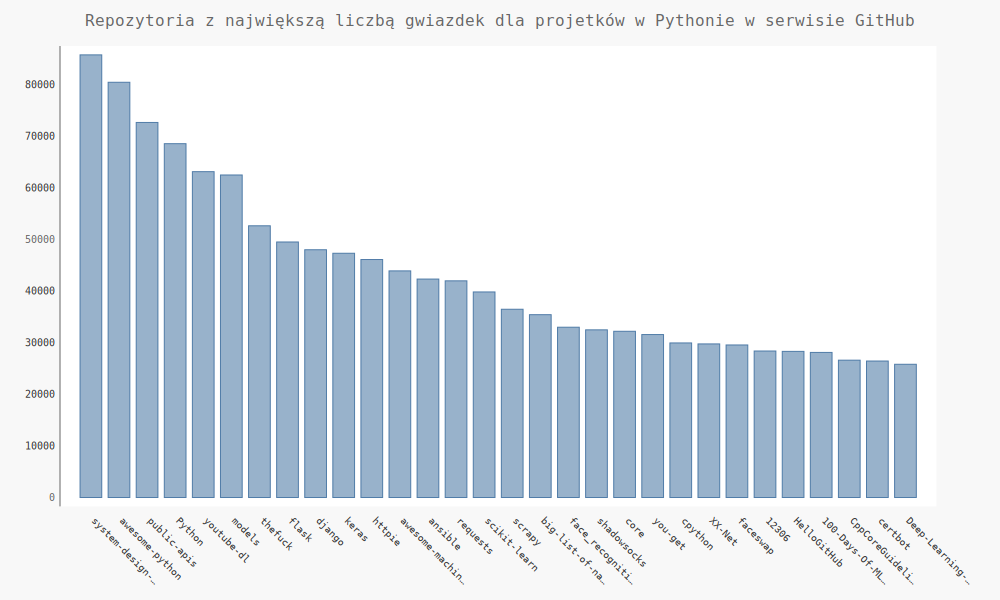

# wizualizacja danych

Projekt jest wprowadzeniem do wizualizacji danych stworzony na podstawie książki "Python Instrukcje Dla Programisty" Eric Matthes. 

Narzędzie które zostało wykorzystane do analizy danych i tworzenia wizulalizacji w tym projekcie to [matplotlib](https://matplotlib.org/), 
czyli biblioteka matematyczna przeznaczona do tworzenia wykresów.

Użyty został również pakiet [Pygal](http://www.pygal.org/en/stable/), za pomocą którego
można tworzyć wizualizacje interaktywne. 
 
 